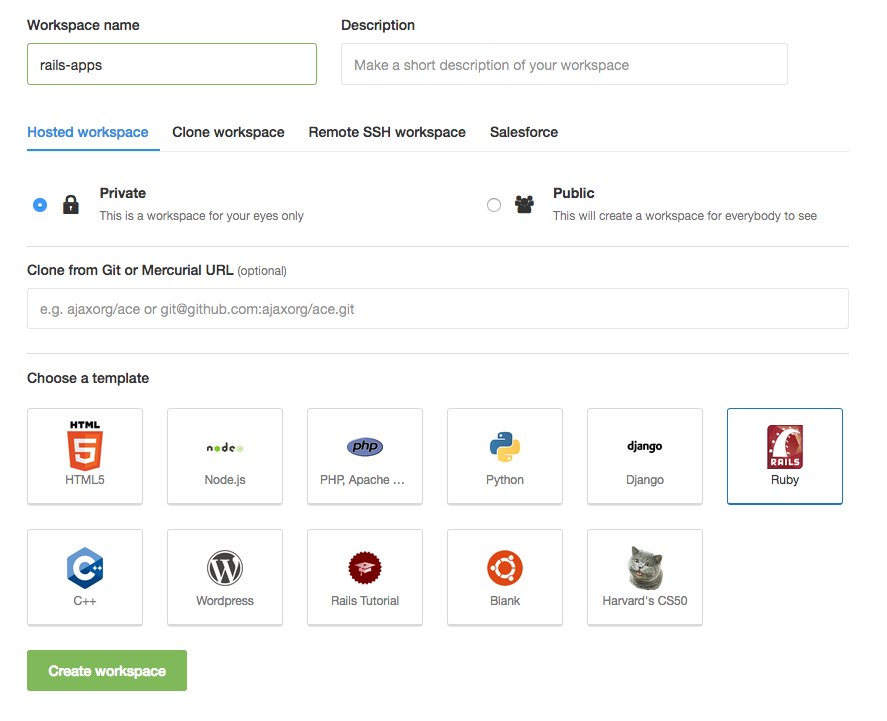

Si vous êtes sur Windows, vous avez trois choix :

1. Installer Ubuntu en [Dual Boot](http://www.everydaylinuxuser.com/2015/11/how-to-install-ubuntu-linux-alongside.html) puis suivre le [tutoriel du programme FullStack](https://github.com/lewagon/setup/blob/master/UBUNTU.md)
1. Si votre ordinateur est très puissant, installer une **machine virtuelle** avec [Virtual Box](https://www.virtualbox.org/), y installer Ubuntu et enfin suivre le même tutoriel ci-dessus.
1. Préférer une option _cloud_, et dans ce cas continuer à lire ce qu'il y a ci-dessous.

# Configurer une _workstation_ Cloud9

## Étape 1 - Créer un compte Cloud9

Rendez-vous sur [c9.io](https://c9.io) et créez-vous un compte. Vous allez pouvoir créer des _workspaces_, c'est-à-dire un environnement de travail. Dans le plan gratuit, il y a un seul _workspace_ privé. Vous pouvez créer d'autres workspaces (avec d'autres installations pour Python ou autre) mais dans ce cas ils seront **publics** (comme pour un repo GitHub public, n'importe qui pourra y accéder en lecture).

## Étape 2 - Créer un nouveau projet



- Nommez votre projet `rails-apps` car nous allons y mettre plusieurs applications Rails
- Réglez votre workspace en **privé**
- Sélectionnez le template "**Ruby**" (et pas Ruby on Rails)
- Cliquez sur le bouton _Create workspace_

Après quelques seconds, votre environnement de développement est prêt. Par défaut, une application Rails a été générée, nous pouvons la supprimer avec la commande :

```bash
rm -rf ~/workspace/*
```

## Étape 3 - Configuration de git et GitHub

Dans le terminal en bas, tapez les commandes suivantes :

```bash
curl https://raw.githubusercontent.com/lewagon/dotfiles/master/gitconfig > ~/.gitconfig

git config --global user.email "seb@lewagon.org"
git config --global user.name "Sebastien Saunier"
```

:warning: Ne mettez pas d'accent dans le `user.name` (ici je n'ai pas mis le `é` à mon prénom),
et si possible mettez le [même email que celui de votre compte GitHub](https://github.com/settings/emails).

Nous allons maintenant nous occuper de la [clé SSH](https://fr.wikipedia.org/wiki/Secure_Shell#SSH_avec_authentification_par_cl.C3.A9s) pour pouvoir communiquer avec GitHub par le terminal. Nitrous nous a déjà généré une paire de clé, il suffit de donner la clé publique à GitHub. Dans le terminal, lancez la commande :

```bash
cat ~/.ssh/id_rsa.pub
```

Copiez les lignes qui viennent de s'afficher (ça commence par `ssh-rsa AAA` et ça finit par un truc du genre `hl4NX7SgX3`).

Rendez-vous ensuite sur [cette page](https://github.com/settings/ssh) pour ajouter la clé.
La commande précédente a mis dans le presse-papier votre clé publique, il n'y a donc qu'à
coller (`⌘` + `V`) dans la zone de texte.

Pour vérifier que tout est configuré, tapez la commande :

```bash
ssh -T git@github.com
```

## Étape 4 - Configuration de PostgreSQL

C'est la base de données :) Dans le terminal, démarrez le service de base de données :

```bash
sudo service postgresql start
```

Ensuite nous avons besoin de faire quelques petites configurations. Toujours dans le terminal :

```bash
sudo su - postgres
psql --command "CREATE ROLE ubuntu LOGIN createdb;"
psql --command "UPDATE pg_database SET datistemplate = FALSE WHERE datname = 'template1';"
psql --command "DROP DATABASE template1;"
psql --command "CREATE DATABASE template1 WITH TEMPLATE = template0 ENCODING = 'UNICODE';"
psql --command "UPDATE pg_database SET datistemplate = TRUE WHERE datname = 'template1';"
psql --command "VACUUM FREEZE;"
exit
```

## Étape 5 - Installer la dernière version de Ruby

Si vous tapez la commande `ruby -v`, vous devriez avoir par défaut une ancienne version de Ruby.
Pour installer la toute dernière version, voici ce qu'il faut exécuter dans le terminal :

```bash
rvm install 2.3.1
rvm --default use 2.3.1
curl https://raw.githubusercontent.com/lewagon/dotfiles/master/irbrc > ~/.irbrc
```

## Étape 6 - Installer Rails

Dans le **Terminal**, nous allons d'abord installer quelques gems utiles pour le cours.

```bash
gem install bundler pry hub
```

Maintenant, nous pouvons **enfin** installer Rails :

```bash
gem install rails
```

## Étape 7 - Vérification que tout fonctionne :

Nous allons maintenant créer une application de vérification :

```bash
cd ~/workspace
rails new verif_setup -T --database=postgresql
cd verif_setup
rails db:create
rails s -b 0.0.0.0
```

Le serveur Rails va se lancer sur le port `8080` (configuré automatiquement par Nitrous). Pour prévisualiser l'application, ils vous suffit de vous rendre à l'URL de la forme:

```
https://rails-apps-VOTRE_USERNAME.c9users.io
```

Si vous voyez l'écran d'accueil de Rails, vous avez réussi !

Bravo !
