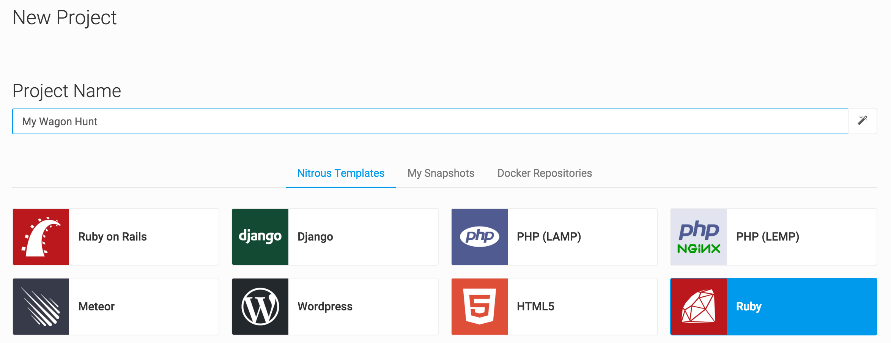
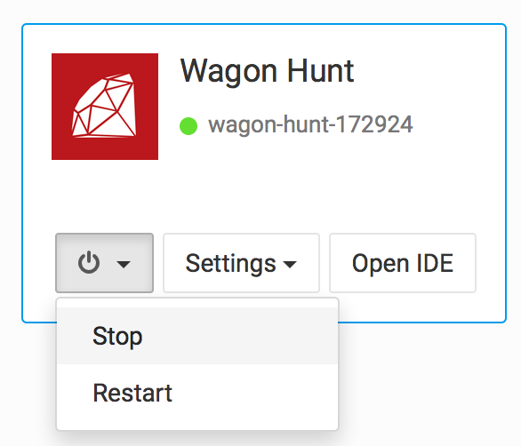

Si vous êtes sur Windows, vous avez trois choix :

1. Installer Ubuntu en [Dual Boot](http://www.everydaylinuxuser.com/2015/11/how-to-install-ubuntu-linux-alongside.html) puis suivre le [tutoriel du programme FullStack](https://github.com/lewagon/setup/blob/master/UBUNTU.md)
1. Si votre ordinateur est très puissant, installer une **machine virtuelle** avec [Virtual Box](https://www.virtualbox.org/), y installer Ubuntu et enfin suivre le même tutoriel ci-dessus.
1. Préférer une option _cloud_, et dans ce cas continuer à lire ce qu'il y a ci-dessous.

# Configurer une _workstation_ Nitrous

## Étape 1 - Créer un compte Nitrous

Rendez-vous sur [nitrous.io](https://www.nitrous.io) et créez-vous un compte, c'est gratuit pour débuter (50h / mois).
Confirmez votre email en cliquant sur le lien reçu dans votre boite mail.

## Étape 2 - Créer un nouveau projet



- Nommez votre projet
- Sélectionnez le template "**Ruby**" (et pas Ruby on Rails)
- Cliquez sur le bouton _Create a Project_

Lors que le projet est prêt, cliquez sur _Open IDE_.

## Étape 3 - Configurer Oh My Zsh

Dans le terminal, lancez :

```bash
if [ -h ~/.zshrc ]; then mv ~/.zshrc ~/.zshrc.backup; fi && curl https://raw.githubusercontent.com/lewagon/dotfiles/master/zshrc > ~/.zshrc
curl https://raw.githubusercontent.com/lewagon/dotfiles/master/irbrc > ~/.irbrc
git clone https://github.com/zsh-users/zsh-syntax-highlighting.git ${ZSH_CUSTOM:-~/.oh-my-zsh/custom}/plugins/zsh-syntax-highlighting
```

## Étape 4 - Mise à jour de git et installation de dépendences

Dans le terminal en bas, tapez les commandes suivantes :

```bash
sudo apt-get update
sudo apt-get install -y software-properties-common
sudo add-apt-repository -y ppa:git-core/ppa
sudo apt-get install -y git nodejs imagemagick
```

Nous allons maintenant configurer `git`. Dans le terminal tapez les commandes suivantes :

```bash
curl https://raw.githubusercontent.com/lewagon/dotfiles/master/gitconfig > ~/.gitconfig

git config --global user.email "seb@lewagon.org"
git config --global user.name "Sebastien Saunier"
```

:warning: Ne mettez pas d'accent dans le `user.name` (ici je n'ai pas mis le `é` à mon prénom),
et si possible mettez le [même email que celui de votre compte GitHub](https://github.com/settings/emails).

Nous allons maintenant nous occuper de la [clé SSH](https://fr.wikipedia.org/wiki/Secure_Shell#SSH_avec_authentification_par_cl.C3.A9s) pour pouvoir communiquer avec GitHub par le terminal. Nitrous nous a déjà généré une paire de clé, il suffit de donner la clé publique à GitHub. Dans le terminal, lancez la commande :

```bash
cat ~/.ssh/id_rsa.pub
```

Copiez les lignes qui viennent de s'afficher (ça commence par `ssh-rsa AAA` et ça finit par un truc du genre `hl4NX7SgX3`).

Rendez-vous ensuite sur [cette page](https://github.com/settings/ssh) pour ajouter la clé.
La commande précédente a mis dans le presse-papier votre clé publique, il n'y a donc qu'à
coller (`⌘` + `V`) dans la zone de texte.

Pour vérifier que tout est configuré, tapez la commande :

```bash
ssh -T git@github.com
```

## Étape 5 - Installer la dernière version de Ruby


Tapez la commande suivante :

```bash
ruby -v
```

Si vous aves une version inférieure à 2.3.1, tapez la commande suivante puis la touche `Enter` :

```bash
rbenv install 2.3.1
rbenv global 2.3.1
```

## Étape 6 - Installation de PostgreSQL

C'est la base de données :) Dans le terminal, lancez les commandes suivantes :

```bash
sudo apt-get install postgresql postgresql-contrib libpq-dev -y
sudo su - postgres
psql --command "CREATE ROLE nitrous LOGIN createdb;"
exit
```

## Étape 7 - Installer Rails

Dans le **Terminal**, nous allons d'abord installer quelques gems utiles pour le cours.

```bash
gem install bundler pry hub
```

Maintenant, nous pouvons **enfin** installer Rails :

```bash
gem install rails -v 5.0.0
```

## Étape 8 - Vérification que tout fonctionne :

D'abord nous devons configurer un port sur notre _workstation_. Allez dans le menu,
_Preview_ -> _Configure Ports_. Ajoutez le port `3000` en _Primary_, validez les changements
et redémarrez la station.

Nous allons créer un dossier temporaire et y générer une application Rails de test :

```bash
mkdir -p ~/tmp && cd ~/tmp
rails _5.0.0_ new verif_setup -T --database=postgresql
cd verif_setup
rails db:create
rails s -b 0.0.0.0
```

Le serveur Rails va se lancer. Dans le menu, cliquez sur _Preview_ -> _Port 3000 (Default)_. Un
nouvel onglet du navigateur va s'ouvrir avec une URL en `*.nitrousapp.com:3000` et vous devriez
voir la page d'accueil de Rails.

Bravo !

## :warning: ATTENTION!

Pour ne pas consommer trop vite votre quota de 50 heures mensuelles, **éteignez** votre _workstation_
lorsque vous avez fini de travailler. C'est au niveau du [Dashboard](https://www.nitrous.io/app/#/dashboard/) :


